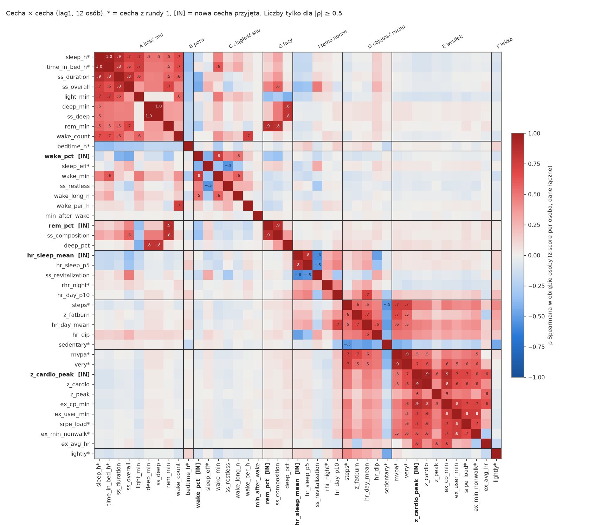
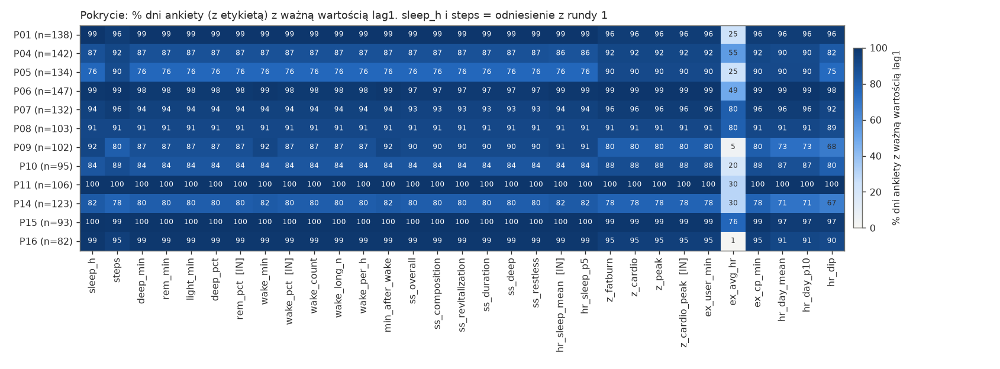
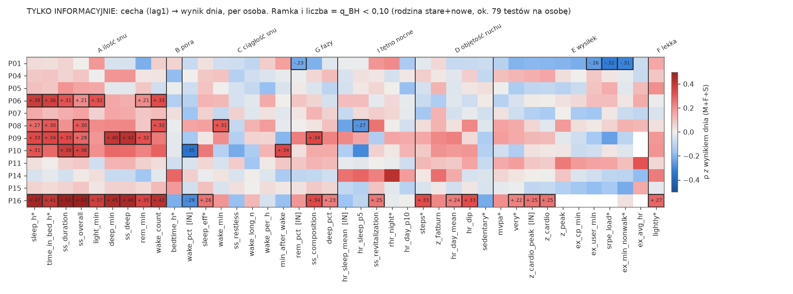
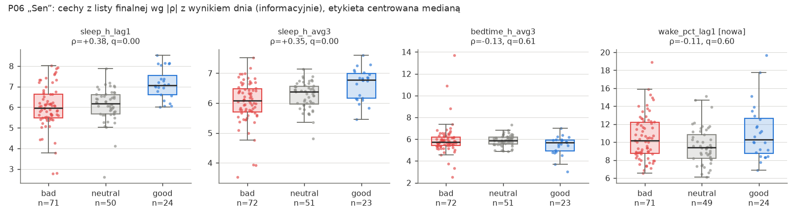
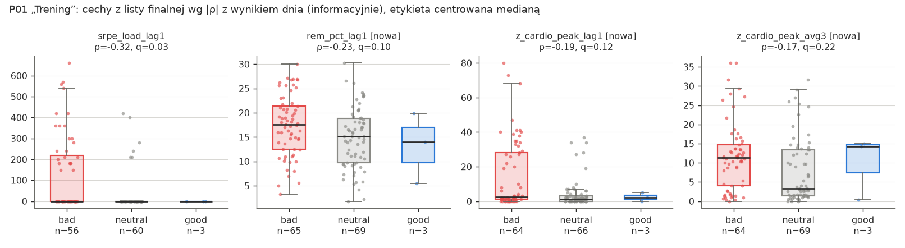
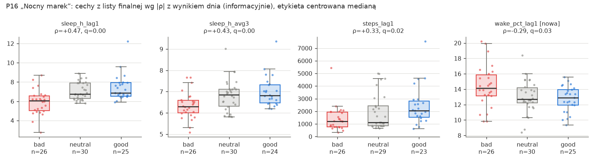
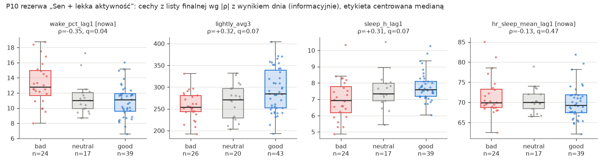

# Analiza PMData – runda 2: pominięte cechy z zegarka

Oct 3, 2026 · zespół analizy danych · uzupełnienie do [analiza-pmdata.md](analiza-pmdata.md) (runda 1) · skrypty: `analysis/build_extra.py`, `eda_extra.py`, `stump_extra.py`, `plots_extra.py`

## TL;DR

- **IN (3 nowe cechy do wyszukiwania wzorców, wszystkie tylko lag1):**
  - `wake_pct` (% czasu w łóżku na jawie) **zastępuje `sleep_eff` w grupie C**. Formuła jest przejrzysta, a Fitbitowe `efficiency` to czarna skrzynka (ρ = 0,40 z prostą efektywnością, sufit 95–100).
  - `rem_pct` (% snu w fazie REM) tworzy nową grupę **G „fazy snu”**. Jest niezależna od długości snu (ρ = 0,15).
  - `hr_sleep_mean` (średnie tętno w czasie snu głównego) tworzy nową grupę **I „tętno nocne”**. To niewygładzony odpowiednik `rhr_night` (ρ z nim tylko 0,27).
- **IN jako zamiennik (bez dodatkowych testów):** `z_cardio_peak` (minuty w strefach cardio + peak, D-1) to wersja `srpe_load` tylko z zegarka (grupa E). U P01 próg „> 10 min” wypada **dokładnie w tych samych 29 dniach** co zalogowany trening.
- **OUT, bo redundantne z grupą A (ilość snu):** `ss_overall`, `ss_duration`, minuty faz (deep/REM/light), `wake_count`; ρ z `sleep_h` 0,50–0,88.
- **OUT, bo to duplikat:** `ss_deep` (= deep min − 1), `ss_composition` (≈ `rem_pct`, 0,86), `hr_sleep_p5` (≈ `hr_sleep_mean`, 0,84), `ss_revitalization` (≈ tętno nocne, −0,57).
- **OUT z powodu jakości:** `minutesToFallAsleep` (zawsze 0), `minutesAfterWakeup` (76% zer), `ex_avg_hr` (1–80% pokrycia), `vo2Max` (129 wpisów), `deep_pct` (Fitbit najsłabiej wykrywa fazę głęboką), `wake_per_h` (mikro-wybudzenia, nieinterpretowalne).
- **OUT, bo miesza się z aktywnością:** `hr_day_mean`, `hr_dip`, `z_fatburn` (ρ 0,5–0,7 z kroki/mvpa, kierunek niejasny). `hr_day_p10` ≈ rodzina RHR, która już jest poza wyszukiwaniem.
- **Koszt testów:** z 13 do 15 wariantów cech (+16% warunków). 95. percentyl maksimów pod H0 rośnie o +0,007 (mediana). W oknie pre-lockdown liczba osób z istotnym wzorcem się nie zmienia (5). W całym okresie P09 traci istotność (p 0,042 → 0,097).
- **Persony:** P06 i P16 bez zmian. P01 zyskuje wzorzec tylko z zegarka (`z_cardio_peak` > 10 min → 23/29 złych, p = 0,009). **P10 się wzmacnia** (`wake_pct` > 12% → 17/31 = 55% vs 14% złych, p < 0,001). Żadna odrzucona osoba (P04, P07, P08, P15) nie staje się użyteczna.

---

## 0. Zakres, metoda, nowe pułapki formatu

- **Zakres:** tylko `pmdata/pXX/fitbit/*`; ankieta służy wyłącznie jako etykieta (M+F+S, centrowana medianą). `googledocs/reporting.csv` jest poza zakresem.
- **Osoby:** 12 z rundy 1 (bez P02, P03, P12, P13).
- **Wyrównanie jak w rundzie 1:**
  - Cechy nocne pochodzą z tego samego snu głównego co `sleep_night.csv` (ten sam `logId`, te same reguły ważności z pkt 12.4–12.5). `lag1` = NaN, gdy sen skończył się później niż 60 min po ankiecie.
  - Cechy dzienne pochodzą z doby D-1, z filtrem `wear_day ≥ 720`.
  - avg3 wymaga ≥ 2 z 3 wartości.
- **Test wyrównania** na dniu kontrolnym z rundy 1 (P01, 2019-11-02) przechodzi: deep 36, REM 83, wake 52 min; `rem_pct` 21,96; `wake_pct` 12,09; `hr_sleep_mean` 54,2; strefy D-1 164 / 3 / 0 min.

Nowe pułapki (uzupełnienie tabeli z pkt 0 rundy 1):

| Plik | Pułapka |
| --- | --- |
| `sleep.json` | **63 z 2064 wpisów to duplikaty** (ten sam `logId`). Runda 1 nie jest dotknięta, bo bierze najdłuższy sen dnia. Przy łączeniu po `logId` trzeba deduplikować. |
| `sleep.json` | `minutesToFallAsleep` = 0 w 1580 z 1586 nocy (Fitbit tego nie mierzy). `efficiency` ≠ `minutesAsleep/timeInBed`: średnio +7 pkt, ρ = 0,40 w obrębie osoby. |
| `sleep.json` | Typ **classic**: `minutesAwake` = awake + restless, ale te minuty nie są porównywalne ze stages (mediana 17 vs 57 min). |
| `sleep_score.csv` | `deep_sleep_in_minutes` = `levels.summary.deep.minutes` (73% równe, reszta −1 min), czyli duplikat. `overall = composition + revitalization + duration` w 98,5%. |
| `time_in_heart_rate_zones.json` | Klucze `BELOW_DEFAULT_ZONE_1` / `IN_DEFAULT_ZONE_1` (fat burn) / `_2` (cardio) / `_3` (peak). **Suma stref = minuty noszenia** (mediana różnicy −2 min), więc strefy potrzebują filtra noszenia. P08 i P14 mają dodatkowo `*_CUSTOM_ZONE`; ignorujemy je, bo strefy domyślne też są w pliku. |
| `heart_rate.json` | `confidence` = 0 w 0,6% odczytów (odrzucamy). Skan regex + agregacja do minut trwa ok. 2 s na osobę, szczyt pamięci ok. 0,7 GB, cache w `cache/hr_derived/`. |
| `exercise.json` | `vo2Max` tylko w 129 z 2440 wpisów (biegi z GPS). `logType`: 69% `auto_detected`, 30% `tracker` (uruchomione na zegarku). |

## 1. `sleep.json` – fazy snu (`levels`)

### 1.1 Typ snu: stages vs classic

Noce główne kończące się w D, dni z ważnym `sleep_h_lag1`:

| osoba | P01 | P04 | P05 | P06 | P07 | P08 | P09 | P10 | P11 | P14 | P15 | P16 | **razem** |
| --- | --: | --: | --: | --: | --: | --: | --: | --: | --: | --: | --: | --: | --: |
| noce | 137 | 123 | 102 | 145 | 124 | 94 | 94 | 80 | 106 | 101 | 93 | 81 | 1280 |
| classic | 0 | 0 | 0 | 1 | 0 | 0 | **5** | 0 | 0 | 2 | 0 | 0 | **8 (0,6%)** |

**Postępowanie z nocami classic:**
- `rem_pct`, `deep_pct`, minuty faz i `wake_count` = NaN.
- `wake_pct` też NaN: harmonizacja awake+restless ≈ wake nie działa (rozkłady różnią się 3×).
- Cechy niezależne od typu (`sleep_h`, `bedtime_h`, `hr_sleep_mean`) zostają.
- Strata jest pomijalna: najwięcej traci P09 (−5 pkt % pokrycia).

### 1.2 Cechy i decyzje

Lag1, 12 osób. Zakres w obrębie osoby = mediana (p90 − p10) per osoba. ρ to Spearman w obrębie osoby (z-score per osoba, dane łączne); w nawiasie mediana per osoba.

| cecha | definicja | pokrycie (% dni) | zakres w obrębie osoby | najbliższa cecha | decyzja |
| --- | --- | --: | --: | --- | --- |
| `deep_min` | summary.deep.minutes | 76–100 | 57 min | sleep_h 0,50 (0,51) | OUT → A (skaluje się z długością snu) |
| `rem_min` | summary.rem.minutes | 76–100 | 67 min | sleep_h 0,55 | OUT → A |
| `light_min` | summary.light.minutes | 76–100 | 105 min | sleep_h 0,73 | OUT → A |
| `deep_pct` | deep / minutesAsleep | 76–100 | 11 pkt | deep_min 0,82; sleep_h 0,01; **rem_pct 0,07** | OUT: Fitbit najsłabiej wykrywa fazę głęboką (pkt 9); chronimy budżet testów |
| **`rem_pct`** | rem / minutesAsleep | 76–100 | 14 pkt | ss_composition 0,86; sleep_h 0,15 | **IN, grupa G** (reprezentant) |
| `wake_min` | minutesAwake | 76–100 | 35 min | wake_pct 0,77; sleep_h 0,45; time_in_bed 0,60 | OUT → C (zależy od długości snu) |
| **`wake_pct`** | 100 · minutesAwake / timeInBed (tylko stages) | 76–100 | 5,9 pkt | wake_min 0,77; wake_long_n 0,51; ss_restless 0,44; sleep_eff −0,40; sleep_h −0,14 | **IN, grupa C** (reprezentant, zastępuje `sleep_eff`) |
| `wake_count` | summary.wake.count | 76–100 | 16 | sleep_h 0,65 | OUT → A (więcej snu → więcej epizodów) |
| `wake_per_h` | wake_count / h snu | 76–100 | 1,7 / h | wake_count 0,75; reszta < 0,26 | OUT: liczy 30-sekundowe mikro-wybudzenia (ok. 4/h to norma fizjologiczna), nieinterpretowalne dla użytkownika |
| `wake_long_n` | wybudzenia ≥ 5 min (bez pierwszego i ostatniego segmentu) | 76–100 | 4 | wake_min 0,58; wake_pct 0,51 | OUT → C (alternatywa dla UI: „you woke up 4 times”) |
| `min_to_fall` | minutesToFallAsleep | – | – | – | OUT: zawsze 0 |
| `min_after_wake` | minutesAfterWakeup | 76–100 | 76% zer | brak | OUT: szum (0–3 min) |

Uzasadnienie `wake_pct` zamiast `sleep_eff` (jakość, nie korelacja z celem):
- `efficiency` Fitbita to wartość własnościowa: nie równa się ani asleep/inBed, ani asleep/(asleep+wake), u classic liczona inaczej.
- Ma sufit: p10–p90 = 90–98, liczby całkowite, ok. 10 unikalnych wartości na osobę.
- `wake_pct` ma jawną definicję (zdanie dla użytkownika: „you were awake 15% of your time in bed”) i jest ciągła (100 unikalnych wartości na osobę).
- Jest prawie niezależna od długości snu (−0,14), w przeciwieństwie do `wake_min` (+0,45). Dzięki temu nie wchodzi w konflikt kierunku z grupą A.

Dlaczego `rem_pct`, a nie minuty REM:
- Minuty faz to w ok. 50–73% „ilość snu” (grupa A).
- Udział procentowy to osobny konstrukt (architektura snu), prawie niezależny od `sleep_h`, `bedtime_h` i aktywności (|ρ| ≤ 0,15).
- REM wybieramy zamiast deep, bo w walidacjach Fitbit vs PSG REM jest wykrywany wyraźnie lepiej niż faza głęboka (pkt 9). Obie fazy są ze sobą niezależne (ρ = 0,07), więc to wybór, a nie redukcja współliniowości.

## 2. `sleep_score.csv`

Łączenie `sleep_log_entry_id = logId` jak w rundzie 1; brak sleep score dla 1,5% wybranych nocy.

| cecha | zakres (p10–p90) | najbliższa cecha | decyzja |
| --- | --- | --- | --- |
| `ss_overall` | 67–86 | ss_duration 0,84; **sleep_h 0,72** | OUT → A. Suma podskal, w 2/3 wynik długości snu. Wygodna jako „wynik nocy” w widoku dnia. |
| `ss_duration` | 33–45 | **sleep_h 0,88** | OUT → A |
| `ss_composition` | 16–22 | **rem_pct 0,86**, rem_min 0,85 | OUT → G (duplikat `rem_pct`) |
| `ss_revitalization` | 14–23 | **hr_sleep_mean −0,57**, ss_restless −0,29 | OUT → I (pochodna tętna nocnego) |
| `ss_deep` | – | **deep_min 1,00** | OUT: duplikat |
| `ss_restless` | 0,05–0,12 | sleep_eff −0,55; wake_pct 0,44 | OUT → C (wartość niejawna, opisana tylko jako „restlessness”) |

## 3. `time_in_heart_rate_zones.json`

Strefy domyślne Fitbita (z wieku, ok. 50 / 70 / 85% HRmax), doba D-1, filtr noszenia.

| cecha | % zer | p50 / p90 (min) | najbliższa cecha | decyzja |
| --- | --: | --- | --- | --- |
| `z_fatburn` | 1 | 91 / 212 | mvpa 0,68; hr_day_mean 0,70; steps 0,57 | OUT → D/E (ruch umiarkowany, redundantny) |
| `z_cardio` | 38 | 2 / 37 | z_cardio_peak 0,95 | OUT (składnik) |
| `z_peak` | 74 | 0 / 14 | z_cardio_peak 0,58 | OUT (za dużo zer) |
| **`z_cardio_peak`** | 38 | 3 / 49 | ex_cp_min 0,88; **srpe_load 0,69**; very 0,65; mvpa 0,51 | **IN jako zamiennik `srpe_load` w grupie E** (wersja tylko z zegarka, kierunek „więcej → gorzej”) |

`z_cardio_peak` vs `srpe_load` per osoba: ρ 0,45–0,86. U P01 warunek `z_cardio_peak_lag1 > 10` pokrywa się w 100% z `srpe_load_lag1 > 0` (29 dni), a pokrycie jest wyższe (133 vs 119 dni). U P05, P09 i P16 (bez logów sRPE) cecha jest prawie stale 0 (p90 0–7 min), więc nie zastąpi u nich `mvpa`.

**Nie tworzymy osobnej grupy H** („intensywność ze stref”): strefy w całości mieszczą się w grupach D i E.

## 4. Cechy z `heart_rate.json`

Wszystkie wartości liczone z minutowych średnich: confidence > 0, 30–220 bpm.

| cecha | definicja | pokrycie | najbliższa cecha | decyzja |
| --- | --- | --- | --- | --- |
| **`hr_sleep_mean`** | średnie HR w [startTime, endTime] wybranego snu głównego; wymagane ≥ 50% minut z odczytem (mediana pokrycia 99%) | 76–100% | hr_sleep_p5 0,84; ss_revitalization −0,57; **rhr_night 0,27**; sleep_h −0,17 | **IN, grupa I** (reprezentant) |
| `hr_sleep_p5` | 5. percentyl minut snu | jw. | hr_sleep_mean 0,84; rhr_night 0,33 | OUT → I (alternatywa odporna na artefakty) |
| `hr_day_mean` | średnie HR w czasie noszenia na jawie, cała doba D-1 (≥ 600 min) | 71–100% | z_fatburn 0,70; mvpa 0,57; steps 0,53; rhr_night 0,31 | OUT: miesza ruch i stan fizjologiczny, kierunek niejasny |
| `hr_day_p10` | 10. percentyl HR na jawie | 71–100% | hr_day_mean 0,72; rhr_night 0,43 | OUT → rodzina RHR (poza wyszukiwaniem od rundy 1) |
| `hr_dip` | 1 − hr_sleep_mean / hr_day_mean | 67–100% | hr_day_mean 0,62; mvpa 0,49 | OUT: pochodna mieszanki ruchu |

Dlaczego `hr_sleep_mean` wchodzi, mimo że `rhr_night` w rundzie 1 odpadło:
- `rhr_night` z `sleep_score` jest mocno wygładzane (lag1 ≈ avg3, ρ = 0,90; zmiana dzień do dnia ok. 1 bpm).
- `hr_sleep_mean` to surowe tętno z tej konkretnej nocy: lag1 vs avg3 ρ = 0,70, zakres w obrębie osoby p10–p90 ok. 8 bpm.
- Wspólnej wariancji jest mało (ρ = 0,27), więc to inna informacja.
- Kierunek z góry: **wyższe tętno w nocy → gorszy dzień** (alkohol, infekcja, późny trening, stres; standardowy marker w aplikacjach typu Oura/Whoop).
- Ostrzeżenie: 5 nocy > 90 bpm (prawdopodobnie choroba albo artefakt) → reguła walidacji w pkt 8.

Wariant „minuty powyżej osobistego progu w ciągu dnia” pominięto: pokrywa się ze strefami (pkt 3).

## 5. Inne: `exercise.json`

| cecha | definicja | najbliższa cecha | decyzja |
| --- | --- | --- | --- |
| `ex_user_min` | minuty ćwiczeń uruchomionych na zegarku lub ręcznie (`tracker`/`manual`) | srpe_load 0,76; ex_min_nonwalk 0,76 | OUT → E. Alternatywa dla `z_cardio_peak`, ale zależy od tego, czy użytkownik uruchomi trening (jak logowanie sRPE). |
| `ex_cp_min` | minuty cardio + peak w trakcie ćwiczeń | z_cardio_peak 0,88 | OUT → E (duplikat) |
| `ex_avg_hr` | średnie HR ćwiczeń nie-Walk (ważone czasem) | z_cardio_peak 0,64 | OUT: istnieje tylko w dni z ćwiczeniem (pokrycie 1–80%) |
| `vo2Max` | – | – | OUT: 129 wpisów |

## 6. Redundancja i zaktualizowane grupy współliniowe

*Spearman w obrębie osoby, lag1, 12 osób, uporządkowane wg grup. Pełne macierze: `cache/extra_ff_pooled.csv`, `cache/extra_ff_median.csv`. Mediany per osoba są w każdej parze bliskie wartości łącznej (±0,05), więc żadna grupa nie jest artefaktem jednej osoby.*

| Grupa | Członkowie (ρ z reprezentantem) | Reprezentant w wyszukiwaniu | Zmiana vs runda 1 |
| --- | --- | --- | --- |
| A. Ilość snu | time_in_bed 0,98; ss_duration 0,88; light_min 0,73; ss_overall 0,72; wake_count 0,65; rem_min 0,55; deep_min / ss_deep 0,50 | **sleep_h** | nowi członkowie |
| B. Pora snu | bedtime_h | **bedtime_h** | – |
| C. Ciągłość snu (było „jakość”) | wake_min 0,77; wake_long_n 0,51; ss_restless 0,44; sleep_eff −0,40 | **wake_pct** (nowa) | **reprezentant zmieniony** z `sleep_eff` |
| D. Objętość ruchu | distance, calories, active_total; z_fatburn 0,57; hr_day_mean 0,53; hr_dip 0,45 | **steps** | nowi członkowie (poza wyszukiwaniem) |
| E. Intensywny wysiłek | mvpa, very, moderately, srpe_load, ex_min; z_cardio_peak (srpe 0,69); z_cardio, z_peak, ex_cp_min, ex_user_min, ex_avg_hr | **mvpa**, albo **srpe_load** u osób logujących; **z_cardio_peak** jako zamiennik srpe_load w trybie tylko-zegarek | nowy zamiennik |
| F. Lekka aktywność | lightly | **lightly** | – |
| **G. Fazy snu** (nowa) | ss_composition 0,86; rem_min 0,88; (deep_pct 0,07, niezależna, OUT) | **rem_pct** | nowa |
| **I. Tętno nocne** (nowa) | hr_sleep_p5 0,84; ss_revitalization −0,57; (rhr_night 0,27, poza wyszukiwaniem) | **hr_sleep_mean** | nowa |
| – | sedentary, rhr_night, rhr_day, hr_day_p10, wake_per_h, min_after_wake, min_to_fall, vo2Max | poza wyszukiwaniem | + nowe odrzucone |

Grupy nowe vs stare są czyste:
- Nowe cechy nocne mają z cechami aktywności |ρ| ≤ 0,11.
- Z cechami snu z rundy 1: `wake_pct`–`sleep_h` −0,14, `rem_pct`–`sleep_h` 0,15, `hr_sleep_mean`–`sleep_h` −0,17, `hr_sleep_mean`–`sleep_eff` −0,16.
- Między sobą: |ρ| ≤ 0,30 (`wake_pct`–`rem_pct` −0,30, reszta par ≤ 0,05).

## 7. lag1 vs avg3

Spearman w obrębie osoby, dane łączne (mediana per osoba prawie identyczna, `cache/eda_extra.out.md` sekcja C).

| cecha | ρ lag1–avg3 | decyzja o wariantach |
| --- | --: | --- |
| wake_pct | 0,60 | **tylko lag1.** Ciągłość snu działa akutnie (jak `sleep_eff` w rundzie 1); oszczędzamy test. |
| rem_pct | 0,58 | **tylko lag1.** Brak przesłanek domenowych do kumulacji; oszczędzamy test. |
| hr_sleep_mean | 0,70 | **tylko lag1.** Sygnał już jest częściowo wygładzony (0,70 > 0,55–0,63 dla snu i ruchu); podwyższone tętno to marker akutny. |
| z_cardio_peak | 0,56 | **lag1 + avg3**, tak samo jak `srpe_load`, który zastępuje |
| (odrzucone, dla porządku) | 0,51–0,71 | hr_sleep_p5 0,70, hr_day_p10 0,71, hr_day_mean 0,66, ss_restless 0,64, reszta 0,51–0,62 |

Warianty avg3 nowych cech nocnych są w `extra_features.csv` (do widoku dnia), ale nie wchodzą do wyszukiwania.

## 8. Zaktualizowana tabela cech do wyszukiwania wzorców

**Zastępuje tabelę z pkt 12, krok 15 rundy 1.** Kierunki są ustalone z góry z wiedzy domenowej, a nie z korelacji z celem.

| cecha | warianty | zły dzień, gdy | uzasadnienie kierunku | krok siatki (zakres p5–p95 osoby) | grupa | status |
| --- | --- | --- | --- | --- | --- | --- |
| sleep_h | lag1, avg3 | poniżej X | mniej snu → zmęczenie | 0,5 h | A | r1 |
| bedtime_h | lag1, avg3 | później niż X | późne zaśnięcie → gorszy dzień | 0,5 h | B | r1 |
| **wake_pct** | lag1 | **powyżej X** | więcej czuwania w nocy → gorzej | **1 pkt %** (ok. 10 progów/osobę) | C | **nowa, zastępuje sleep_eff** |
| **rem_pct** | lag1 | **poniżej X** | mniej REM → gorsza regulacja emocji i zmęczenie | **2 pkt %** (ok. 10 progów) | G | **nowa** |
| **hr_sleep_mean** | lag1 | **powyżej X** | wyższe tętno nocne → słabsza regeneracja (stres, infekcja, alkohol) | **1 bpm**; 2 bpm, gdy p95 − p5 osoby > 15 bpm (ok. 10–15 progów) | I | **nowa** |
| steps | lag1, avg3 | poniżej X | mniej ruchu → gorzej | 1000 (500, gdy zakres < 5000) | D | r1 |
| mvpa | lag1, avg3 | poniżej X | mniej wysiłku → gorzej | 10 min | E (osoby bez sRPE) | r1 |
| srpe_load | lag1, avg3 | powyżej X (0, 100, 200…) | obciążenie → zmęczenie | 100 AU | E (≥ 25 sesji) | r1 |
| *z_cardio_peak* | lag1, avg3 | powyżej X (0, 10, 20…) | jak srpe_load | 10 min | E | **zamiennik srpe_load** w trybie tylko-zegarek (`load_source = "hr_zones"`); w PMData domyślnie `srpe` |
| lightly | lag1, avg3 | poniżej X | mniej lekkiego ruchu → gorszy nastrój | 20 min | F | r1 |

- **Tylko widok dnia i fallback |z| > 2 (bez wyszukiwania):** `rhr_night`, `hr_sleep_p5`, `sleep_eff`, `ss_overall` (jako „wynik nocy”), `wake_min`, `wake_long_n`, `deep_pct`, `sedentary`, `time_in_bed`, `distance`, `calories`.
- **Liczba kandydatów:** z 13 do 15 wariantów cech (sleep_eff → wake_pct to zamiana; +rem_pct lag1, +hr_sleep_mean lag1). Grupy: A, B, C, D, E, F, G, I, po jednej cesze z każdej.

## 9. Zmiany w specyfikacji czyszczenia (pkt 12 rundy 1)

Do dodania w `build_daily.py` / `clean.py`. Referencyjna implementacja jest w `analysis/build_extra.py`.

1. **Krok 4 (sen), nowe podkroki:**
   - `sleep.json` → `drop_duplicates("logId")` przed jakimkolwiek łączeniem.
   - Dla wybranego snu (ten sam `logId` co dziś) zapisz `sleep_type`.
   - Gdy `type == "stages"`:
     - `wake_pct = 100 · minutesAwake / timeInBed`;
     - `rem_pct = 100 · levels.summary.rem.minutes / minutesAsleep`.
   - Gdy `classic`: obie cechy = NaN.
2. **Krok 4a (nowy, tętno nocne):**
   - W tym samym przebiegu co `build_wear.py` (jeden skan regex `heart_rate.json`) wyznacz minutowe średnie HR (confidence > 0, 30–220 bpm).
   - `hr_sleep_mean` = średnia minut w [startTime, endTime) wybranego snu.
   - NaN, gdy pokrycie < 50% minut snu.
   - Cache per osoba (`cache/hr_derived/pXX.csv`).
3. **Krok 5:** reguła „sen skończony przed ankietą” dotyczy też `wake_pct`, `rem_pct`, `hr_sleep_mean` (lag1 = NaN, avg3 z D-1 i D-2).
4. **Krok 6 (aktywność):** `z_cardio_peak = IN_DEFAULT_ZONE_2 + IN_DEFAULT_ZONE_3` z `time_in_heart_rate_zones.json` (data lokalna). Strefy `*_CUSTOM_ZONE` ignorujemy.
5. **Krok 7 (noszenie):** `wear_day < 720` → `z_cardio_peak` = NaN, jak inne cechy aktywności, bo suma stref = minuty noszenia.
6. **Krok 8 (trening):** parametr `load_source ∈ {"srpe", "hr_zones"}`.
   - `srpe` (domyślny w PMData): jak w rundzie 1.
   - `hr_zones`: grupa E-obciążenie używa `z_cardio_peak`, aktywna u osób z ≥ 20 dniami `z_cardio_peak > 10` w oknie analizy (inaczej E = mvpa).
7. **Krok 9 (lagi):** nowe cechy nocne liczymy w lag1 i avg3 (avg3 tylko do widoku dnia). `z_cardio_peak` lag1 i avg3. Test jednostkowy rozszerzamy o P01, 2019-11-02:
   - `wake_pct` = 52/430 = 12,09;
   - `rem_pct` = 83/378 = 21,96;
   - `hr_sleep_mean` ≈ 54,2;
   - `z_cardio_peak` (D-1 = 2019-11-01) = 3.
8. **Krok 13 (walidacja):**

   | cecha | NaN, gdy |
   | --- | --- |
   | wake_pct | `type ≠ stages`, `timeInBed = 0` albo > 50 |
   | rem_pct | `type ≠ stages` albo > 50 |
   | hr_sleep_mean | pokrycie < 50% albo poza 35–110 bpm |
   | z_cardio_peak | `wear_day < 720` |

9. **Krok 15:** tabela z pkt 8 tego dokumentu.
10. **Krok 16:** grupy A–F + G + I (pkt 6).
11. **Krok 17 (logowanie N):** dodać kolumny pokrycia `wake_pct`, `rem_pct`, `hr_sleep_mean`, `z_cardio_peak` oraz liczbę nocy classic per osoba.

### Pokrycie nowych cech

- Nowe cechy nocne mają pokrycie `sleep_h` minus noce classic: P09 87 vs 92%, P14 80 vs 82%; u pozostałych bez straty.
- `hr_sleep_mean` ma praktycznie to samo pokrycie co `sleep_h` (P04 86 vs 87%).
- `z_cardio_peak` = pokrycie `steps`.
- Najsłabsze pokrycie ma P05 (76%), tak jak w rundzie 1.

---

## 10. Cecha → cel (TYLKO INFORMACYJNIE)

> Decyzje z pkt 1–8 podjęliśmy na podstawie jakości, pokrycia i redundancji. Korelacje z celem policzyliśmy w tym samym przebiegu i pokazujemy je wyłącznie po to, żeby ocenić wpływ na persony. Uczciwie: wybór `wake_pct` zamiast `sleep_eff` uzasadniamy przejrzystością formuły i rozkładem, ale `wake_pct` daje też najlepszy nowy wzorzec u P10. To ryzyko ręcznego dopasowania, analogiczne do reguły minority z rundy 1 (pkt 11).

**Metoda jak w `corr_target.py`:**
- Spearman z wynikiem dnia (M+F+S) i z mood.
- p_eff z efektywnym n (Bartlett).
- BH-FDR w obrębie osoby i celu, na **pełnej rodzinie stare + nowe (ok. 79 testów na osobę, w rundzie 1 ok. 27)**.

Wyniki: `cache/extra_corr_person.csv`, `extra_corr_pooled.csv`, `eda_extra.out.md` sekcja D.

### 10.1 Dane łączne w obrębie osoby (wynik dnia, lag1)

| cecha | ρ łączne | osoby z ρ w oczekiwanym kierunku | osoby z q < 0,10 | p między osobami | ρ łączne (mood) |
| --- | --: | --: | --: | --: | --: |
| sleep_h (ref. r1) | +0,170 | 11/12 | 5 | 0,003 | +0,02 |
| **wake_pct** | **−0,081** | **10/12** | 2 (P10, P16) | 0,047 | −0,04 |
| sleep_eff (zastępowana) | +0,103 | 11/12 | 1 | 0,001 | +0,07 |
| **rem_pct** | +0,021 | 8/12 | 1 (P01, **w przeciwnym kierunku**) | 0,40 | +0,04 |
| **hr_sleep_mean** | −0,004 | 9/12 | 0 | 0,61 | +0,05 |
| **z_cardio_peak** | −0,008 | 4/12 (kierunek „więcej → gorzej”) | 1 (P16, przeciwny) | 0,68 | +0,01 |
| ss_overall (OUT, A) | +0,165 | 12/12 | 5 | 0,001 | +0,07 |
| deep_min (OUT, A) | +0,138 | 9/12 | 2 | 0,008 | +0,06 |
| wake_count (OUT, A) | +0,144 | 10/12 | 3 | 0,006 | 0,00 |

**Wnioski:**
- Najsilniejsze „nowe” związki (`ss_overall`, `ss_duration`, `deep_min`, `light_min`, `wake_count`) to w całości grupa A: powtarzają efekt długości snu. Słusznie wypadają jako redundantne.
- `wake_pct` ma spójny kierunek u 10/12 osób, ale słaby efekt łączny (|ρ| = 0,08, mniej niż `sleep_eff` 0,10).
- `rem_pct` i `hr_sleep_mean` nie mają efektu populacyjnego; mogą działać tylko u pojedynczych osób.
- Mood nadal reaguje najsilniej na lekką aktywność (runda 1). Żadna nowa cecha tego nie zmienia: najwyżej `z_fatburn` avg3 +0,12, czyli ruch umiarkowany (D/E).

### 10.2 Wpływ na persony (stump z rundy 1, reguła minority, test globalny)

Konfiguracje w `stump_extra.py`:
- `spec1` – finalna lista z rundy 1;
- `spec2` – lista z pkt 8;
- `r1` / `r2` / `r2_wide` – szeroka siatka z `stump_check.py` (r2_wide = wszystkie wiarygodne nowe cechy, łącznie z avg3);
- `r1_watch` – srpe_load zastąpione przez z_cardio_peak.

Pełne wyniki: `cache/stump_extra*.csv`, `stump_extra*.out.md`.

| osoba | najlepszy wzorzec spec1 (runda 1) | najlepszy wzorzec spec2 | zmiana |
| --- | --- | --- | --- |
| **P06** „Sen” | good: sleep_h > 6,5 h, 19/54 vs 5%, p = 0,008 | to samo, p = 0,008 | **bez zmian.** Nowe cechy |ρ| ≤ 0,11, n.s. |
| **P01** „Trening” | bad: srpe_load > 0, 23/29 = 79% vs 37%, p < 0,001 | to samo | **bez zmian**, ale tryb tylko-zegarek daje ten sam wzorzec: **z_cardio_peak lag1 > 10 min → 23/29 = 79% vs 39%, p = 0,009** (pre-lockdown 22/28, p < 0,001). `rem_pct` ma u P01 kierunek odwrotny (ρ = −0,23: więcej REM → gorzej), więc kierunek ustalony z góry go nie pokaże. |
| **P16** „Nocny marek” | bad: sleep_h < 5,5 h 10/10, p < 0,001; good: steps avg3 > 3000, p = 0,018 | to samo | **bez zmian.** `wake_pct` ρ = −0,29 (q = 0,03), ale słabsze niż sen. |
| **P10** (rezerwa) | bad: sleep_h < 7 h, 13/23 = 57% vs 19%, p = 0,016 | **bad: wake_pct > 12% → 17/31 = 55% vs 14%, p < 0,001**; good: lightly avg3 > 340, p < 0,001 | **wzmocniona.** Efekt `wake_pct` nie jest krótkim snem: ρ częściowe przy kontroli `sleep_h` = −0,31, w dni robocze −0,46. „Oba” (wake > 12% i sen < 7 h) → 80% złych, „żadne” → 15%. Persona „sen: długość + ciągłość + lekki ruch”. |
| P08 | bad: sleep_h avg3 < 7 h, p = 0,19 | bad: hr_sleep_mean > 61 bpm → 9/14 = 64% vs 24%, p = 0,058 | Nadal nieistotne. Dni z wysokim tętnem tworzą klastry (12–13.01, 12–14.02), prawdopodobnie infekcje, czyli 2–3 epizody, a nie 14 dowodów. **Nie staje się użyteczna.** |
| P04 | bad: bedtime avg3, p = 0,23 | to samo, p = 0,31 | Nic nowego (`deep_pct` avg3 tylko w r2_wide, p = 0,34). |
| P07 | bad: bedtime avg3, p = 0,27 | bad: wake_pct > 13%, p = 0,32 | Nic. |
| P15 | bad: sleep_h < 7,5 h, p = 0,65 | to samo, p = 0,74 | Nic. |
| P09 | bad: sleep_h < 5,5 h, p = 0,042 | to samo, p = 0,097 (pre-lockdown 0,032 → **0,016**) | W całym okresie traci istotność; w oknie wzorców (pre-lockdown) zostaje. |

Wykresy dni złych, neutralnych i dobrych (cechy z listy finalnej wg |ρ|, plus najlepsza nowa cecha):

**Rekomendacja dla person:**
- Zostają P06, P01, P16, rezerwa P10.
- P01 można pokazać w wersji tylko-zegarek (`z_cardio_peak`). To mocniejsza historia dla aplikacji zegarkowej: „After days with more than 10 min in cardio/peak heart-rate zones, 23 of 29 days were bad days (vs 39% otherwise).”
- P10 dostaje drugi czytelny wzorzec snu: „When you were awake more than 12% of your time in bed, 17 of 31 days were bad days (vs 14% otherwise).”

---

## 11. Ryzyka i zastrzeżenia

| # | Kwestia | Wpływ / propozycja |
| --- | --- | --- |
| 1 | **Dokładność faz Fitbita.** W walidacjach względem PSG (np. Fitbit Charge 2, de Zambotti i in. 2018) faza lekka jest wykrywana najlepiej, REM umiarkowanie, a głęboka najsłabiej (czułość orientacyjnie ok. 0,5). Fitbit zawyża sen lekki i zaniża głęboki. | `rem_pct` tylko jako „Fitbit estimate”, w zdaniach bez języka klinicznego. `deep_pct` poza wyszukiwaniem. Przy wyborze REM vs deep nie oglądaliśmy korelacji z celem dla tej decyzji, ale obie liczby są w tabeli 10.1. |
| 2 | **Noce classic** (0,6%, P09 5%). | Cechy faz i `wake_pct` = NaN; nie harmonizujemy (awake+restless ≠ wake). Pomijalny wpływ. |
| 3 | **Koszt wielokrotnego testowania.** spec1 → spec2: z 13 do 15 wariantów cech, warunki per osoba (mediana) z 46 do 54 (+16%). 95. percentyl maksimum pod H0 rośnie o +0,007 (mediana, max +0,044) w jednostkach score. Osoby z istotnym wzorcem: cały okres 5 → 4 (P09), pre-lockdown 5 → 5. | Wariant „wszystko” (r2_wide, ok. 30 wariantów cech) podnosi próg o +0,014–0,016 i usuwa P09 także pre-lockdown, a P16 good spada z p = 0,018 do 0,036. **Dlatego dodajemy tylko 2 warianty i jedną zamianę.** Każdy kolejny wariant cechy podnosi próg o ok. 0,002–0,004 i realnie zabiera osoby na granicy. |
| 4 | **`hr_sleep_mean` jest epizodyczne** (infekcje, święta, alkohol poza zakresem danych). Wzorzec może opisywać 2–3 epizody choroby (P08). | Test cykliczny częściowo to obsługuje. W UI: „your heart rate during sleep was elevated”, bez sugerowania przyczyny. Split-half (pkt 5.3 koncepcji) jest tu szczególnie ważny. |
| 5 | **Strefy HR są domyślne, liczone z wieku**, nie osobiste. P08 i P14 mają strefy własne. U osób o niskiej sprawności lub z wysokim HR spoczynkowym marsz może wpadać w cardio. | `z_cardio_peak` tylko jako zamiennik sRPE w trybie tylko-zegarek. Aktywacja wymaga ≥ 20 dni z > 10 min. |
| 6 | **Ryzyko ręcznego dopasowania** przy wyborze `wake_pct` (pkt 10). | Zweryfikować walidacją z pkt 5 koncepcji (przetasowane etykiety, ≤ 5% osób z wzorcem) z nową listą. Jeśli zespół woli zachowawczo: zostawić `sleep_eff` w C, a `wake_pct` tylko w widoku dnia. |
| 7 | **Dostępność w produkcie.** `wake_pct` i `rem_pct` pochodzą z endpointu snu, `z_cardio_peak` z dziennego podsumowania (tanie). `hr_sleep_mean` wymaga intraday HR (dostęp „Personal” w Fitbit Web API). | Jeśli intraday HR jest niedostępne: grupa I wypada, a `rhr_night` zostaje tylko w widoku dnia. |
| 8 | **Kierunek `rem_pct` u części osób odwrotny** (P01: więcej REM → gorzej, prawdopodobnie odbicie REM po ciężkim dniu). | Kierunek ustalony z góry nie wybierze odwrotnego wzorca. To celowe (koncepcja 2.1), ale oznacza, że u P01 G jest martwą grupą. |
| 9 | Dzienne HR (`hr_day_*`) liczyliśmy z całej doby kalendarzowej na jawie, nie z 06–24, bo P16 jest na jawie ok. 14–06. | Cechy są OUT, więc bez wpływu na wyszukiwanie. |

## Pliki

| Plik | Zawartość |
| --- | --- |
| `analysis/build_extra.py` | Ekstrakcja: fazy snu, sleep_score, strefy HR, exercise, cechy z `heart_rate.json` → `cache/extra_night.csv`, `extra_day.csv`, `extra_features.csv` (klucz pid + D, `*_lag1` / `*_avg3`), `cache/hr_derived/pXX.csv` |
| `analysis/eda_extra.py` | Jakość, pokrycie, redundancja, lag1 vs avg3, korelacje z celem → `cache/eda_extra.out.md`, `extra_ff_*.csv`, `extra_corr_*.csv`, `extra_coverage.csv` |
| `analysis/stump_extra.py` | Stump i test globalny dla konfiguracji spec1 / spec2 / r1 / r2 / r2_wide / r1_watch → `cache/stump_extra*.csv`, `stump_extra*.out.md` (`--prelock`) |
| `analysis/plots_extra.py` | Wykresy `analysis/plots/extra_*.png` |

Uruchamianie (po rundzie 1): `uv run --with pandas --with numpy --with scipy --with tabulate --with matplotlib python <skrypt>.py`, w kolejności: build_extra → eda_extra → stump_extra (`--prelock` osobno) → plots_extra. Pliki z rundy 1 nie były modyfikowane.
